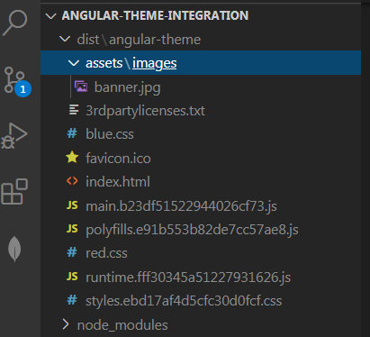

# Angular Theme Integration
## Dynamically Load CSS on click theme button

Run "npm start"

we can lazy load CSS files from angular.json

Normally if you generate an Angular app, you’ll get a styles.css or styles.scss file (based on whether you choose to use some CSS precompiler or not). This style gets directly compiled and injected into your index.html. In fact, if you open the angular.json file, you’ll find a configuration like :

```
"angular-theme": {
    ...
    "build": {
        ...
        options: {
          ...
          "styles": [
              "src/styles.scss",
          ],
        }
    },
    ...
},
```

and finally in your index.html something like

```
<!doctype html>
<html lang="en">
<head>
  ...
  <link rel="stylesheet" href="styles.11660fe9b6fe10ffd079.css"></head>
<body>
  ...
</body>
</html>
```

### Create various scss files for colors theme like black, red, blue
main.scss & _variables.scss are defualt css files. We have to load dynamically black.css or red.css or blue.css file according to the change of theme. 

Hence, we need to tell the Angular CLI to NOT include these styles (black.scss, blue.scss, red.scss) as we are going to load them on the fly. This can be done by including them as follows:
```
"styles": [
							"src/styles.scss",
							"src/assets/styles/main.scss",
							{
								"input": "src/assets/themeCSS/black.scss",
								"bundleName": "blue",
								"inject": false
							},
							{
								"input": "src/assets/themeCSS/blue.scss",
								"bundleName": "blue",
								"inject": false
							},
							{
								"input": "src/assets/themeCSS/red.scss",
								"bundleName": "red",
								"inject": false
							}
						],
```

Hint: you might have seen lazy being used when configuring styles in the angular.json. It has been deprecated in favor of inject however, as the latter better expresses the actual meaning.

To see the effect, compile the app with ng build.


### Dynamically load CSS on Runtime
Now that we have separate CSS files being produced by the Angular CLI, we can think about how to lazy load them. In your app you should encapsulate the behavior in a dedicated service. For the purpose of showcasing it here, I simply create a setTheme(...) function in theme service and use the Document to add the link to the <head> section. Set theme from app component.

```
import { DOCUMENT } from '@angular/common';
import { Inject, Injectable, Renderer2 } from '@angular/core';
import { Theme } from './theme';

@Injectable({
  providedIn: 'root'
})
export class ThemeService {
  private style: HTMLLinkElement;
  private cssFile: string;
  private themeCSSID: string = 'themeCSS';
  constructor(
    @Inject(DOCUMENT) private document: Document
  ) { }

  setTheme(theme: Theme, renderer2: Renderer2) {
    this.cssFile = `${theme}.css`;
    this.removeExistingThemeStyle(renderer2, this.themeCSSID);
    
    // Create a link element via Angular's renderer to avoid SSR troubles
    this.style = renderer2.createElement('link') as HTMLLinkElement;

    // Set type of the link item and path to the css file
    renderer2.setProperty(this.style, 'rel', 'stylesheet');
    renderer2.setProperty(this.style, 'href', this.cssFile);
    renderer2.setProperty(this.style, 'id', this.themeCSSID);

    // Add the style to the head section
    renderer2.appendChild(this.document.head, this.style);
  }

  removeExistingThemeStyle(renderer2: Renderer2, themeCSSID: string) {
    const themeIDHTMlElem = this.document.getElementById(themeCSSID);
    if (themeIDHTMlElem) {
      renderer2.removeChild(this.document.head, themeIDHTMlElem);
    }
  }
}

```

### change script of Package.json
To see the effect, compile the app with ng build.

```
"start": "npm run build && ng serve",
```

Run "npm start" instead of ng serve

### Reference
https://juristr.com/blog/2019/08/dynamically-load-css-angular-cli/

